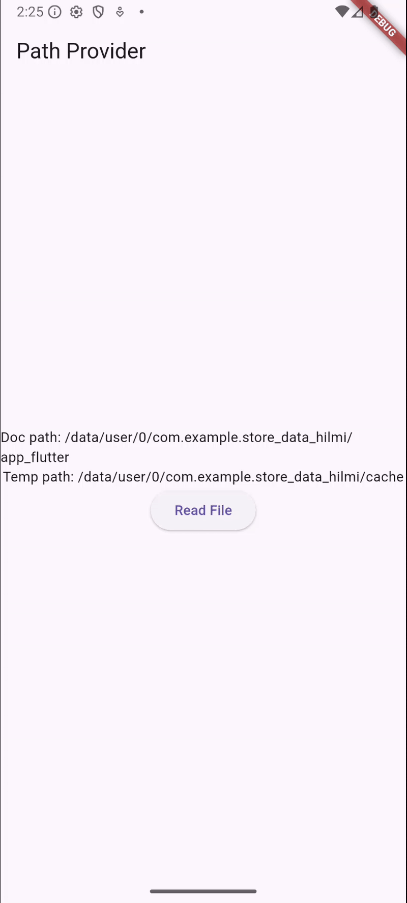

Hanif Faishal Hilmi

TI-3F

Absen 15

---
# Codelabs 13: Persistensi Data
---
## Praktikum 5: Akses filesystem dengan path_provider

### Soal 7
- Jelaskan maksud kode pada langkah 3 dan 7 !
    - langkah 3: fungsi asynchronous yang bertugas menuliskan data ke dalam sebuah file di memori perangkat.
    - langkah 7: menampilkan document dan temporary path, dan button Read File. Jika button ini ditekan, fungsi readfile akan dijalankan dan menampilkan list pizza.
- Capture hasil praktikum Anda berupa GIF dan lampirkan di README.
