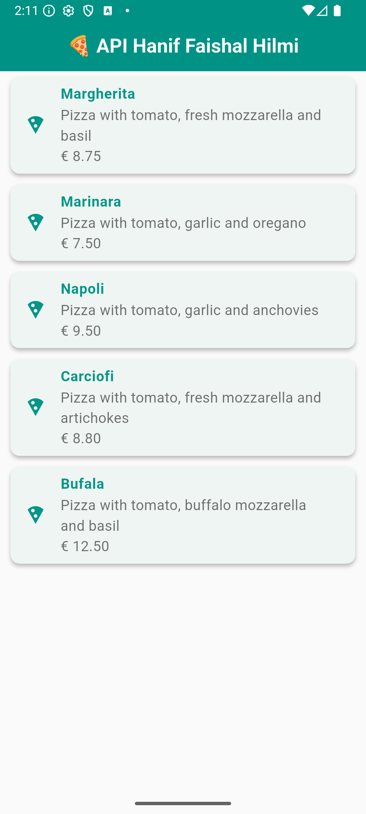

Hanif Faishal Hilmi

TI-3F

Absen 15

---
# Codelabs 14: RESTful API
---
## Praktikum 1: Membuat layanan Mock API

### Soal 1

- Tambahkan nama panggilan Anda pada title app sebagai identitas hasil pekerjaan Anda.
- Gantilah warna tema aplikasi sesuai kesukaan Anda. 
- Capture hasil aplikasi Anda, lalu masukkan ke laporan di README dan lakukan commit hasil jawaban Soal 1 dengan pesan "W14: Jawaban Soal 1"
