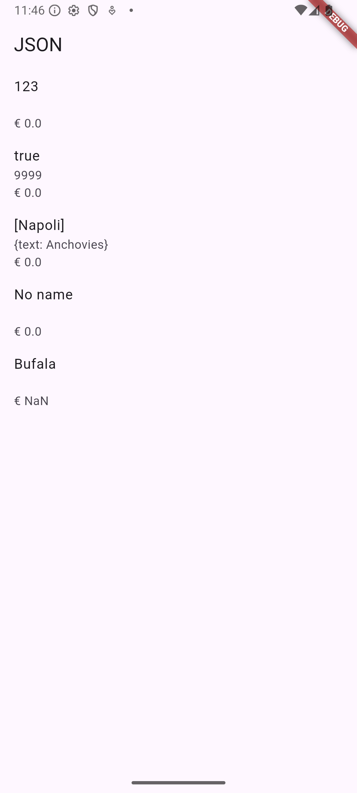

Hanif Faishal Hilmi

TI-3F

Absen 15

---
# Codelabs 13: Persistensi Data
---
## Praktikum 2: Handle kompatibilitas data JSON

### Soal 4
Capture hasil running aplikasi Anda, kemudian impor ke laporan praktikum Anda!
