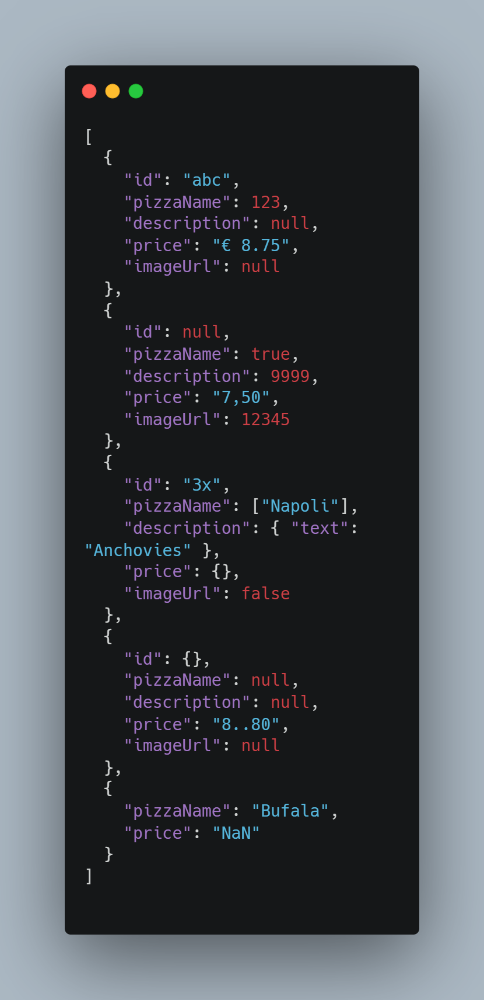
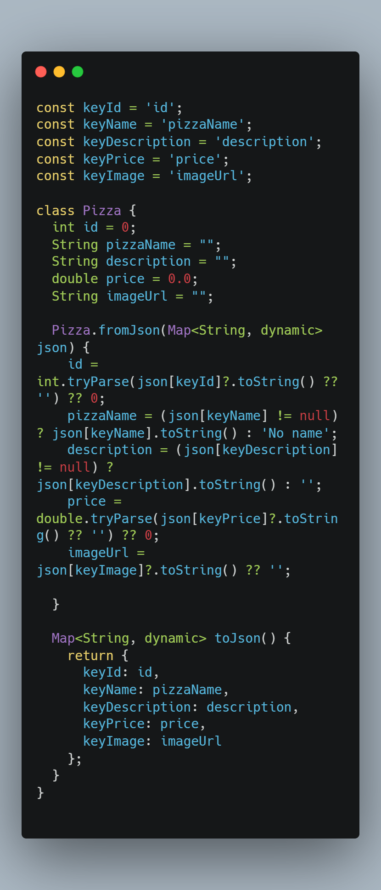
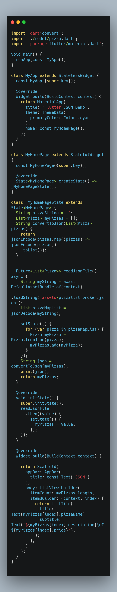
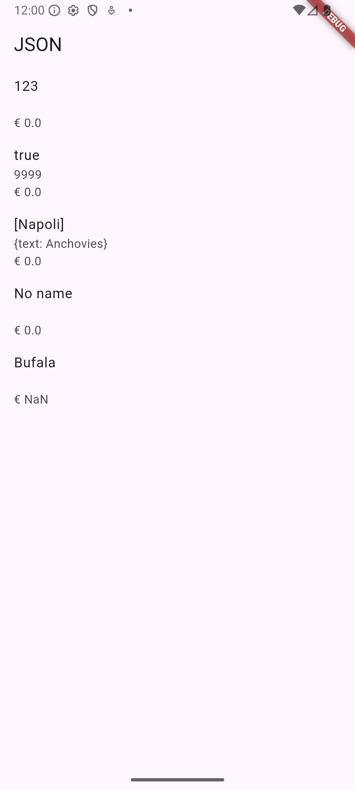

Hanif Faishal Hilmi

TI-3F

Absen 15

---
# Codelabs 13: Persistensi Data
---
## Praktikum 3: Menangani error JSON

### Soal 5
- Jelaskan maksud kode lebih safe dan maintainable!
    - lebih maintainable : menghindari typo key JSON, mengubah nama key cukup edit satu baris, model tetap konsisten, dan mempermudah refactor.
    - lebih safe (aman) : tidak crash meskipun JSON rusak, nilai null dan salah tipe tertangani, harga dan ID aman diparse.
- Capture hasil praktikum Anda dan lampirkan di README.

