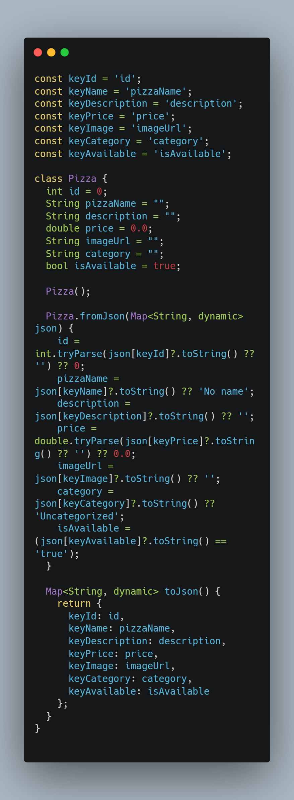
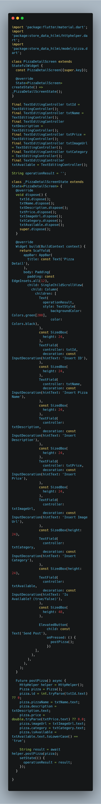
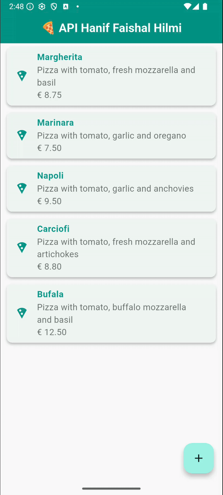

Hanif Faishal Hilmi

TI-3F

Absen 15

---
# Codelabs 14: RESTful API
---
## Praktikum 2: Mengirim Data ke Web Service (POST)

### Soal 2

- Tambahkan field baru dalam JSON maupun POST ke Wiremock!

- Capture hasil aplikasi Anda berupa GIF di README dan lakukan commit hasil jawaban Soal 2 dengan pesan "W14: Jawaban Soal 2"
