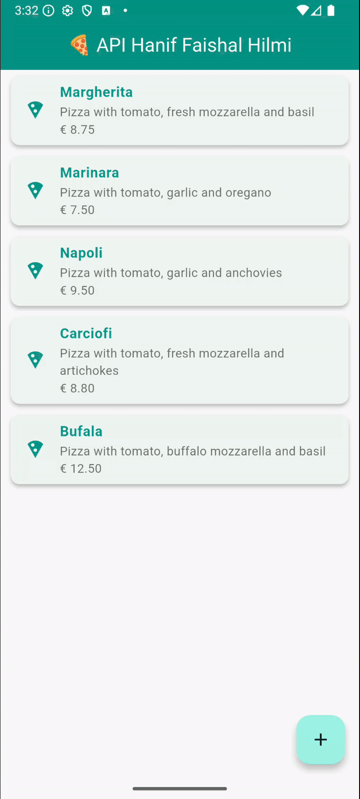

Hanif Faishal Hilmi

TI-3F

Absen 15

---
# Codelabs 14: RESTful API
---
## Praktikum 4: Menghapus Data dari Web Service (DELETE)

### Soal 4

- Capture hasil aplikasi Anda berupa GIF di README dan lakukan commit hasil jawaban Soal 4 dengan pesan "W14: Jawaban Soal 4"
