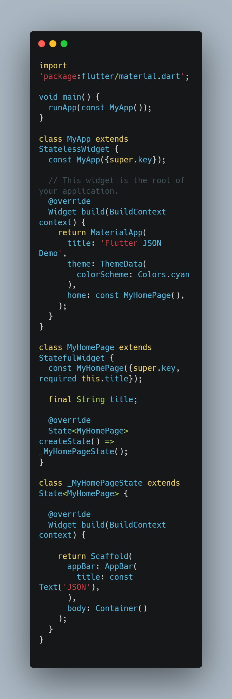
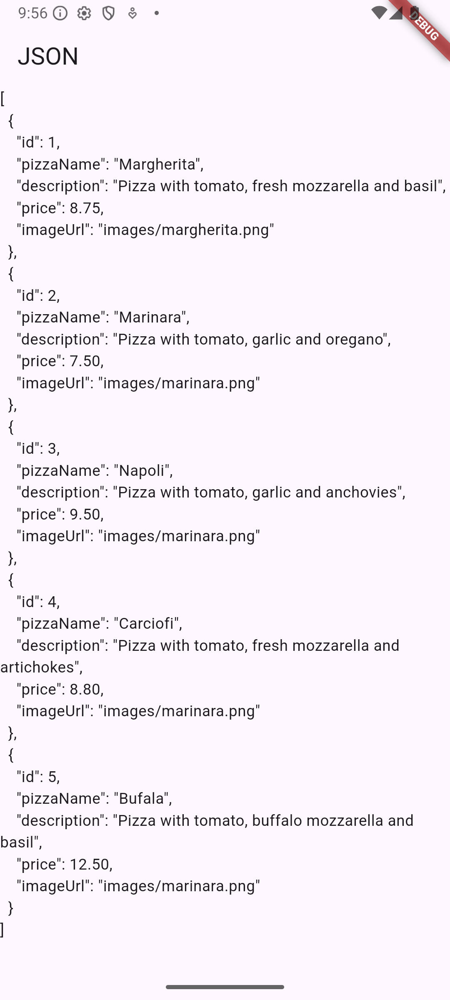
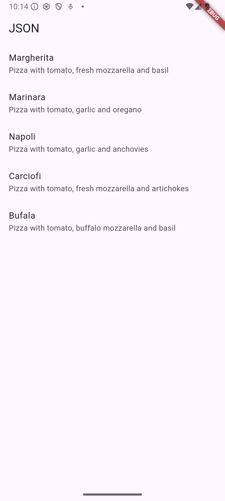

Hanif Faishal Hilmi

TI-3F

Absen 15

---
# Codelabs 13: Persistensi Data
---
## Praktikum 1: Konversi Dart model ke JSON

### Soal 1
- Tambahkan nama panggilan Anda pada title app sebagai identitas hasil pekerjaan Anda.
- Gantilah warna tema aplikasi sesuai kesukaan Anda.

  

### Soal 2
- Masukkan hasil capture layar ke laporan praktikum Anda.

### Soal 3
- Masukkan hasil capture layar ke laporan praktikum Anda.

