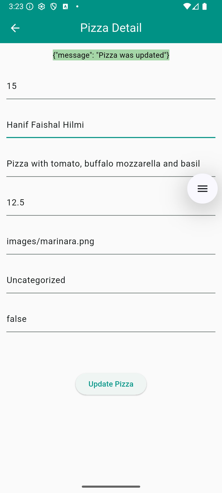
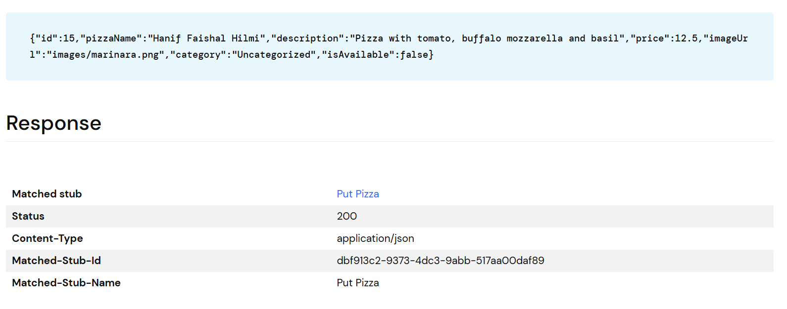

Hanif Faishal Hilmi

TI-3F

Absen 15

---
# Codelabs 14: RESTful API
---
## Praktikum 3: Memperbarui Data di Web Service (PUT)

### Soal 3

- Ubah salah satu data dengan Nama dan NIM Anda, lalu perhatikan hasilnya di Wiremock. 

- Capture hasil aplikasi Anda berupa GIF di README dan lakukan commit hasil jawaban Soal 3 dengan pesan "W14: Jawaban Soal 3"
