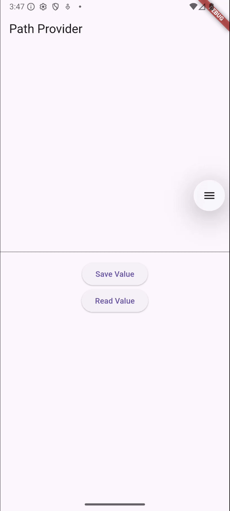

Hanif Faishal Hilmi

TI-3F

Absen 15

---
# Codelabs 13: Persistensi Data
---
## Praktikum 7: Menyimpan data dengan enkripsi/dekripsi

### Soal 9

- Capture hasil praktikum Anda berupa GIF dan lampirkan di README.
